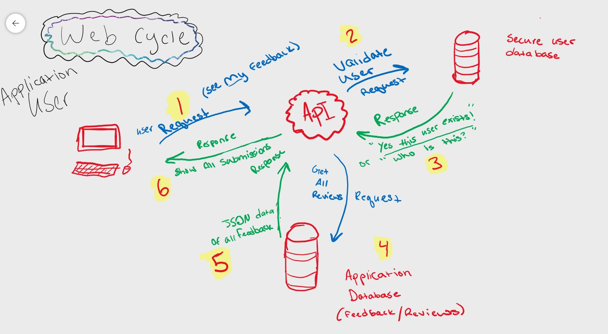
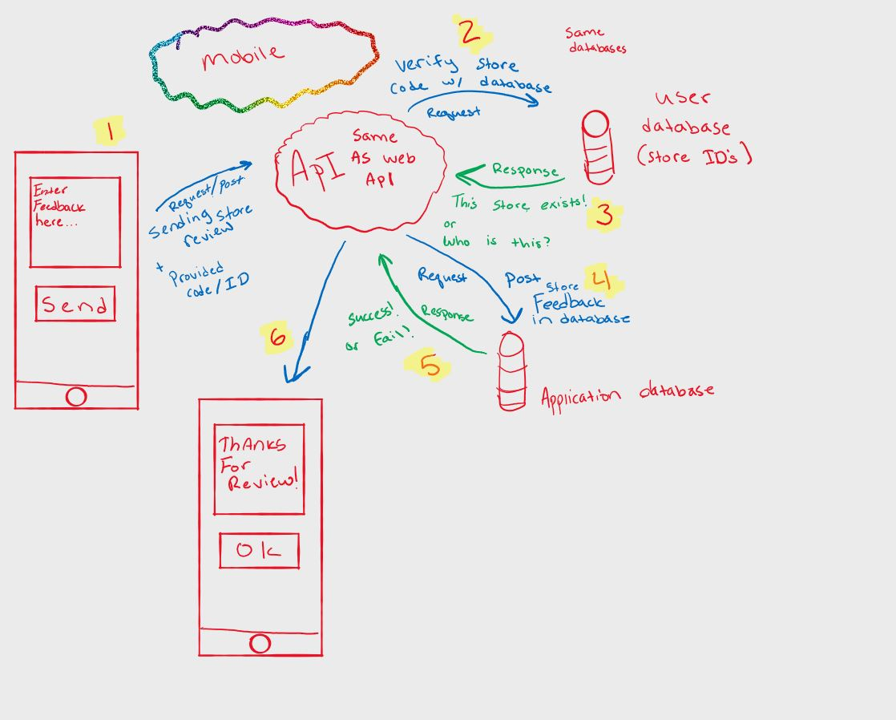

## Web Application
- Businesses sign up on the web application and receive a 6-10 digit code (ID CODE)
- businesses advertise the mobile application and hand out the 10 digit code requesting feedback from users or clientele
- users download the app and are prompted to enter a code to identify which business they are sending feedback too
- after entering the code, verifying it through the API and database, and receiving back a verification code
- User can enter in plain text a simple feedback report, and click "send" on their device. The process is then complete and the user is returned back to the main menu.
- The business requesting feedback can then log into the web application and view, manage, and edit their profile, as well as view and delete reviews/feedback left by users who submitted feedback using their unique code.

## What’s the point?
Imagine a restaurant that isn’t doing very well in business. All the employees work hard, and the food isn't that bad! The restaurant signed up for a 3-month subscription for FEEDBACK.APP. During month one not much happens, The restaurant employees hand out cards saying "please leave your honest reviews at this app, Download, review, delete it less than 3 minutes! Enter this code!". During the second month, the restaurant is starting to get feedback, saying the food isn’t always on point and several improvements on several dishes are noted. Service could be improved as well! The restaurant works hard to fix these issues over time and business starts to improve, by the third month the restaurant is receiving compliments on improvements made to the quality of service and food, as suggested by anonymous reviews from direct clients.

- Consider educational licenses for educators to get anonymous feedback from students on how to teach better.
- Consider employers of large businesses who don’t have time, or resources to survey their ground-level working crew for the environment, or way of business improvements/suggestions. 
- Consider Renting the API service to "game night" type games where the game is centered around anonymous submissions from players.

## neat ideas:
- Like yelp, give users accounts on mobile devices, and allow users to be rewarded for continuous feedback reports to ideally help a business save money in the long run by expediting the way businesses are run by suggestions from workers (or educators given feedback by students in a class setting) (incentive programs to keep clients using the app longer)

---------------------------------
## PLAN: 
- Initial Planning phase ***05/20**
- Initial Funding pitch ***06/12***
- start Prototype  ***06/15***
- Social outreach, and research to local buisnesses, in and out of state ("would you use a service like this, if so how much would you reasonably pay for a service like this")***06/15***
- 2nd Funding pitch ***07/01***
- Hire 2nd developer ***07/01***
- Planning phase (Security, Legal, Web app logistics, API) *** 07/05 (when second developer hired)***
- Construction of Web application and API  ***07/06***
- Testing & security for Web app and API  ***09/05 (very generous timeline)***
- Planning phase (Mobile app) ***09/07***
- Mobile  Testing & security & Deployment ***09/25****
- Application polish and Alpha launch for testing ***10/01***
- Commercial Application launch  ***11/01***
---------------------------------
#### Concerns: Will users go out of their way to download an app, and leave feedback for a buisness that they care about?
---------------------------------
## Tools Used

- C#
- ASP.Net Core
- Entity Framework
- MVC
- xUnit
- Bootstrap
- Azure

---------------------------
## Data Flow (Frontend, Backend, REST API)

---------------------------
## Data Model

### Overall Project Schema

---------------------------
## Model Properties and Requirements

### Message

| Parameter | Type | Required |
| --- | --- | --- |
| ID  | int | YES |

# COMING SOON!
## Recent Updates
---------------------------------
## Usage
### Overview of Recent Posts
### Creating a Post
### Enriching a Post
### Viewing Post Details
## Change Log

------------------------------

## Authors
Tanner Percival

------------------------------

