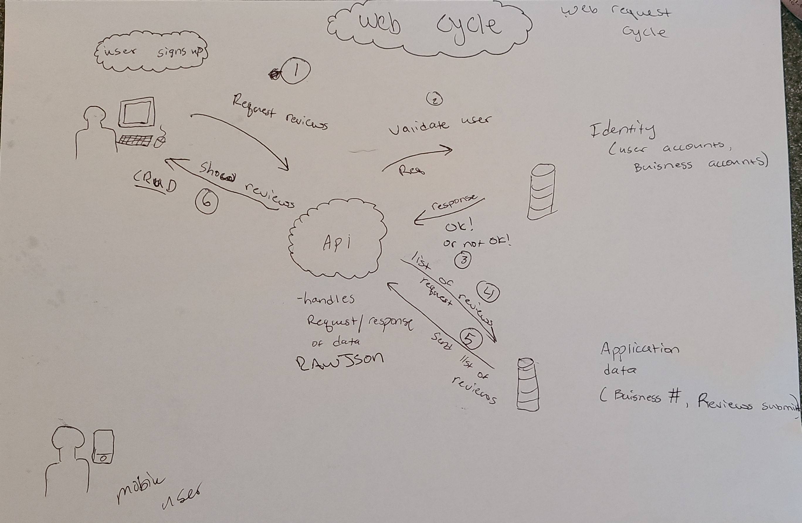
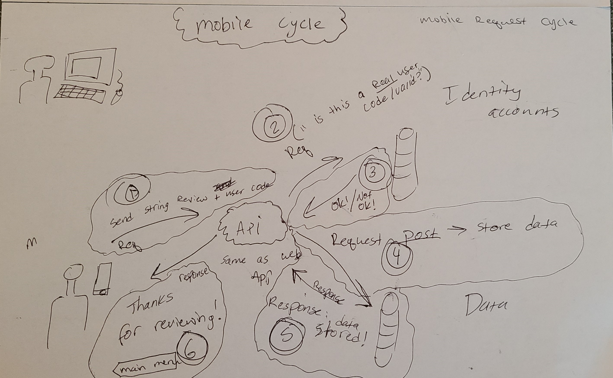
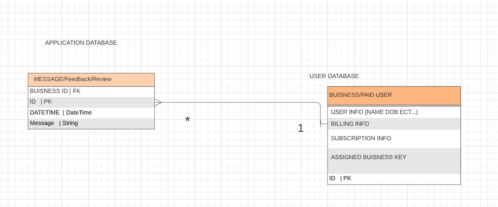

---------------------------------
---------------------------------

---------------------------------
## We are deployed on Azure!

coming sooon
---------------------------------
## Web Application
- Businesses sign up on the web application and receive a 10 digit code (ID CODE)
- businesses advertise the mobile application and hand out the 10 digit code requesting feedback from users or clientele
- users download the app, and are prompted to enter a code to identify which business they are sending feedback too
- after entering the code, verifying it through the API and database, and receiving back a verification code
- User can enter in plain text a simple feedback report, and click "send" on their device. The process is complete.

- Businesses can later sign in to the web application and CRUD the reviews left by people who have entered their business code into the application for feedback

- Building a web application to handle the registry of the businesses or licenses for anonymous feedback. next, I will need to create an API to handle the request and response cycle for both the mobile application and the web application to interface with the same databases with the same API functions.

---------------------------------

## Tools Used

- C#
- ASP.Net Core
- Entity Framework
- MVC
- xUnit
- Bootstrap
- Azure

---------------------------------

## Recent Updates
---------------------------------

## Usage

### Overview of Recent Posts

### Creating a Post

### Enriching a Post

### Viewing Post Details

---------------------------
## Data Flow (Frontend, Backend, REST API)

---------------------------
## Data Model

### Overall Project Schema

---------------------------
## Model Properties and Requirements

### Message

| Parameter | Type | Required |
| --- | --- | --- |
| ID  | int | YES |

### User

---------------------------

## Change Log

------------------------------

## Authors
Tanner Percival

------------------------------

